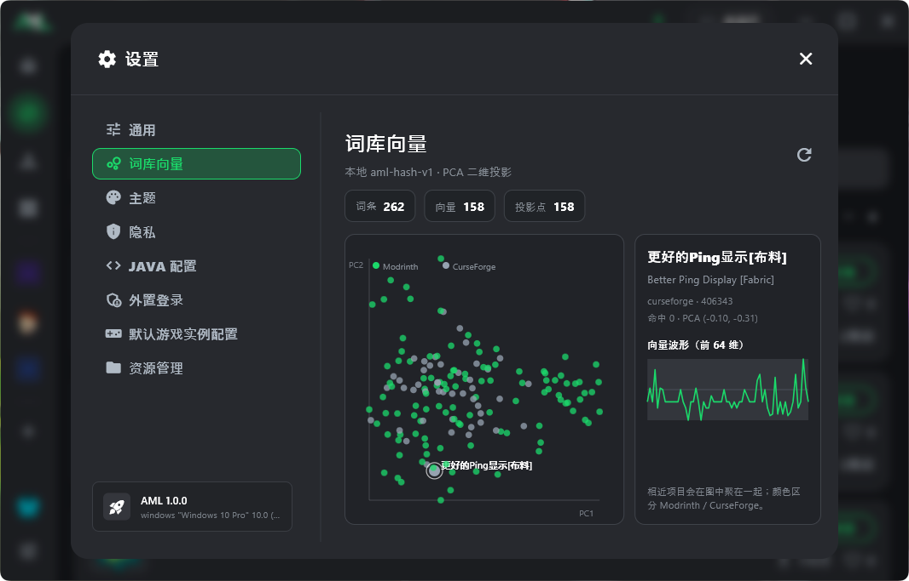

发现页可以用中文找模组：词库记住「原名 ↔ 译名」，本地向量帮你找意思相近的条目。用得越多，搜得越准。

## 能做什么

- **中文搜**：例如搜「钠」，词库命中 Sodium 等英文名，并带上相似项，再与源站结果合并成列表。
- **边用边学**：浏览、搜索发现页时，自动把原名、译名、简介写入本地 `app.db`，重启仍在。
- **本地向量**：`aml-hash-v1` 特征哈希，不上传、不调云端 embedding；可在设置里开关。
- **可视化**：设置 →「词库向量」查看 PCA 散点与向量波形，方便确认词库是否在增长。

## 怎么用

1. **设置 → 通用**  
   - 打开「翻译发现内容」：简介走 MCIM，名称/概述走微软翻译，并写入词库。  
   - 打开「本地词库中文搜索」：中文查询会先查词库再搜源站。  
   - 打开「语义向量搜索」：FTS 弱命中时用本地向量补召回（默认建议开启）。
2. 在 **发现页** 正常浏览、搜索一段时间，让常用模组沉淀进词库。
3. 再试中文关键词；列表前几项通常是词库置顶命中，后面是源站结果。
4. 需要核对时，打开 **设置 → 词库向量**，刷新投影图。

同一查询会缓存约 **30 分钟**，短时间内重复搜索不会反复打源站。

## 小提示

- 字要对：例如「钠」而不是「纳」，词库里才有对应译名时才容易直接命中。
- 新模组第一次出现可能仍是英文；打开详情或列表翻译后，下次中文搜就会顺很多。
- 词库与向量都在本机资源目录的 `app.db` 里，换机器不会自动带走，除非你备份了该目录。
